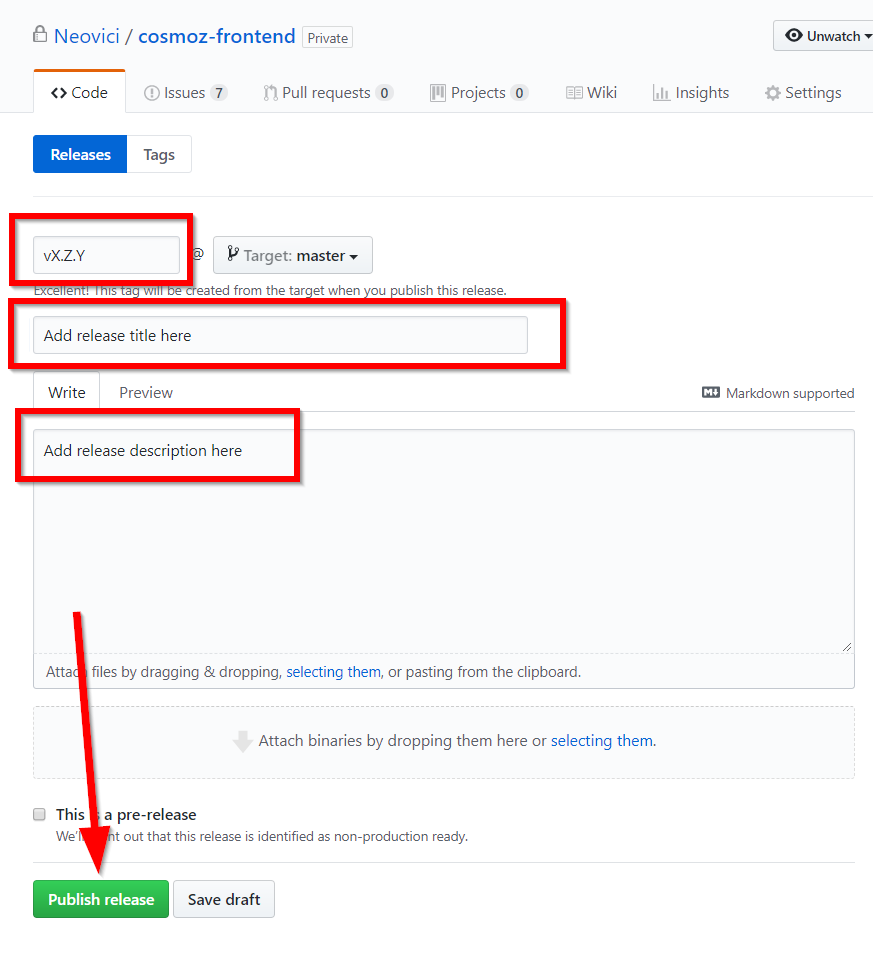
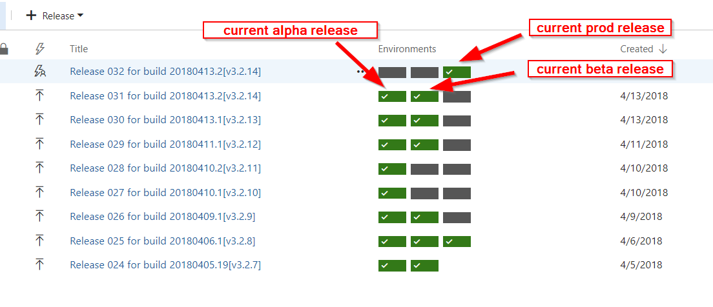
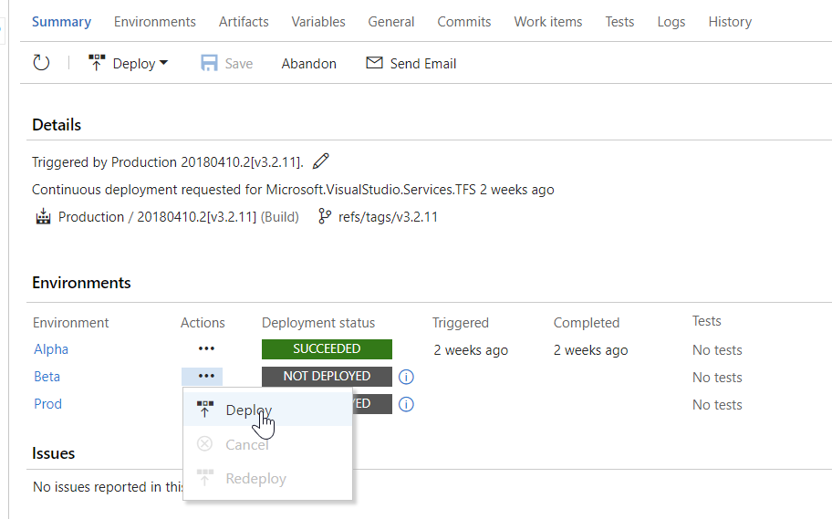

Continuous integration and deployment
================================================

Continus integration
--------------------

Application is setup for CI with Travis at https://travis-ci.com/Neovici/cosmoz-frontend.

A travis build is triggered when any the following occurs:

* a commit is pushed to branches master or demo
* a pull request is submitted

The build steps are the following:

#. install

   This step will install npm packages used for the build by using ``yarn install``.

   When npm packages have been installed, yarn will run ``polymer install``.

#. before_script

   This step will run eslint on the frontend sources.

#. script

   This step will run the build script.

Deployment
-------------------

Application is setup for CD with Visual Studio Team Services (VSTS) at https://neovici.visualstudio.com/Cosmoz3-frontend.

A VSTS build is triggered when a tag is pushed to the cosmoz Frontend github repository.

The build definition performs the same steps as the Travis build. On success, the build will publish a zip file artifact with the content of the dist folder.

This release will be automatically deployed to the alpha environment at https://alpha.cosmoz.com.

Deployment of the release to beta and prod environement has to be done manually.

Building and deploying the alpha environment
^^^^^^^^^^^^^^^^^^^^^^^^^^^^^^^^^^^^^^^^^^^

From the command line
"""""""""""""""""""""

::

    git tag -a vX.Y.Z -m "Version description"
    git push origin vX.Y.Z

The tag name must be a valid semantic version number prefixed with the 'v' letter.
Any other tag will not be built and deployed by Travis.

You may also use ``git push --follow-tags`` instead of specifying the tag name.

From the github web interface
"""""""""""""""""""""""""""""

Go the the github "new release" page at https://github.com/Neovici/cosmoz-frontend/releases/new

Fill the fields, ensuring the tag name follows the vX.Y.Z pattern, then click on "Publish release".

Deploying the beta and prod environments
^^^^^^^^^^^^^^^^^^^^^^^^^^^^^^^^^^^^^^^^

Go the Releases page on VSTS https://neovici.visualstudio.com/Cosmoz3-frontend/_release?definitionId=1&_a=releases

On this page, you can view all the releases that have been generated on VSTS for the frontend

The release title column contains the tag name that produces a release.
The environments column contains 3 rectangles representing the 3 environments: alpha, beta and prod.
A grayed rectangle indicates the release has not been deployed to the environment, while a green one means that the
release has been deployed to the environment.

You can determine the latest deployed release for an environment by looking for the latest green rectangle for 
that environment.

Normally, deployment to alpha is done automatically after the build, except when a build is triggered manually.

In order to deploy to beta or prod, open the release to deploy by clicking on its title.

In the release Summary page, click on the "..." button close to the environment you want to deploy, then click on deploy:

When deploying to beta, deployment should start immediately, while prod deployment will require an additional approval.

Pre-deployment approval for prod deployment
"""""""""""""""""""""""""""""""""""""""""""

When triggering a production deployment, a pre-deployment approval is required, by a different user than the one who triggered the 
deployment.

So if user A triggers a deployment to production, another user will have to login to VSTS and go to the releases page
https://neovici.visualstudio.com/Cosmoz3-frontend/_release?releaseId=38&definitionId=1&_a=releases 

In the "environements" column, the release waiting for deployment approval will be displayed with a |approve-icon| icon.

.. |approve-icon| image:: approve-icon.png
    :alt: Approve icon

The second user can click on this icon and approve the deployment.